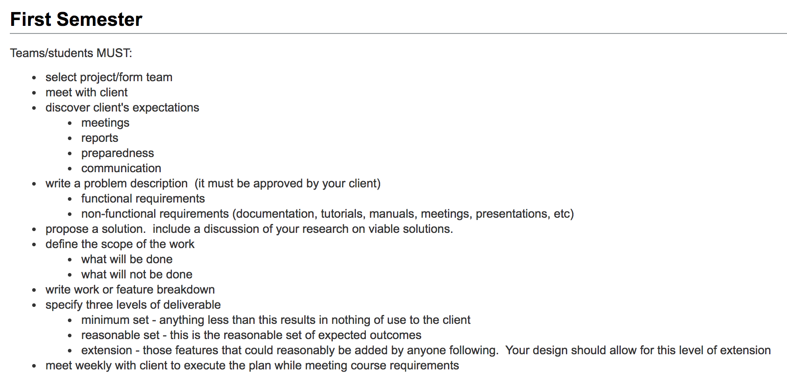

# Additional Considerations for Project Proposals

Here is a smattering of relevant course content of the engineering senior design project courses that this collection is intended to serve.
Reading some of this may help guide the level of clarity, background, and specificity provided in the project proposals.

## [UIUC CS 492: Senior Design Project](https://seniorprojects.cs.illinois.edu/confluence/display/CourseContent/Syllabus)

## [UIUC ECE 445: Senior Design Project](https://courses.engr.illinois.edu/ece445/)
Project proposal ideas are fairly freeform at first, entailling just a description in conversational language. Unfortunately, access to see example posts of students past requires login with university credentials.